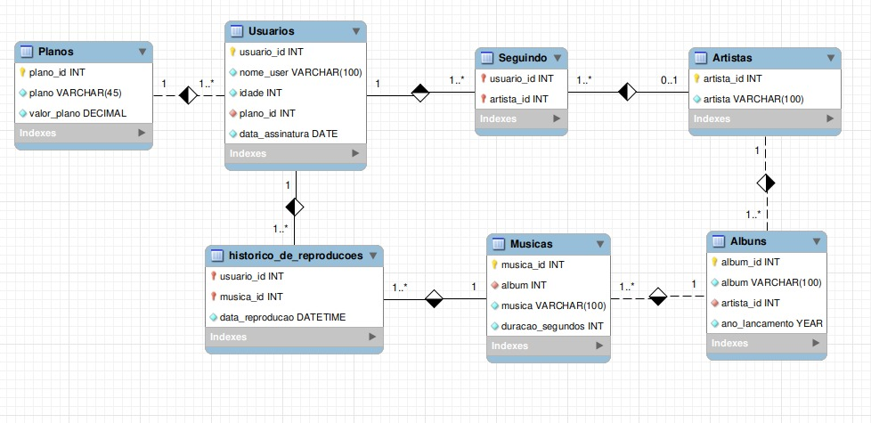

# Boas vindas ao repositório do projeto One For All!

<div align="center">
  
 </div>
<br/>
<br/>

## O que foi desenvolvido 👨‍💻

Neste projeto da Trybe de codinome "One For All", realizei a normalização de uma tabela na terceira forma normal, criei seu diagrama e acessei as informações através de queries utilizando SQL com MySQL Workbench.

## Orientações

<details>
  <summary><strong>:whale: Rodando no Docker vs Localmente</strong></summary><br />

  ## Com Docker

  > Rode os serviços `node` e `db` com o comando `docker-compose up -d`.
  - Lembre-se de parar o `mysql` se estiver usando localmente na porta padrão (`3306`), ou adapte, caso queria fazer uso da aplicação em containers. A recomendação é pela performance do seu computador, pois o `docker-compose.yml` está configurado para mapear a porta padrão do `mysql` do container para a porta `3307` e não `3306`. 
  - Esses serviços irão inicializar um container chamado `one_for_all` e outro chamado `one_for_all_db`.
  - A partir daqui você pode rodar o container `one_for_all` via CLI ou abri-lo no VS Code.

  > Use o comando `docker exec -it one_for_all bash`.
  - Ele te dará acesso ao terminal interativo do container criado pelo compose, que está rodando em segundo plano;
  - As credencias de acesso ao banco de dados estão definidas no arquivo `docker-compose.yml`, e são acessíveis no container através das variáveis de ambiente `MYSQL_USER` e `MYSQL_PASSWORD`. 💡

  > Instale as dependências [**Caso existam**] com `npm install`

  ⚠ Atenção ⚠ Caso opte por utilizar o Docker, **TODOS** os comandos disponíveis no `package.json` (npm start, npm test, npm run dev, ...) devem ser executados **DENTRO** do container, ou seja, no terminal que aparece após a execução do comando `docker exec` citado acima.

  ⚠ Atenção ⚠ O **git** dentro do container não vem configurado com suas credenciais. Ou faça os commits fora do container, ou configure as suas credenciais do git dentro do container.

  ⚠ Atenção ⚠ Não rode o comando npm audit fix! Ele atualiza várias dependências do projeto, e essa atualização gera conflitos com o avaliador.

  ⚠ Atenção ⚠ Caso você esteja usando macOS e ao executar o `docker-compose up -d` se depare com o seguinte erro:

  ~~~bash
  The Compose file './docker-compose.yml' is invalid because:
  Unsupported config option for services.db: 'platform'
  Unsupported config option for services.node: 'platform'
  ~~~

> Foram encontradas 2 possíveis soluções para este problema:
> 1. Você pode adicionar manualmente a option `platform: linux/amd64` no service do banco de dados no arquivo docker-compose.yml do projeto, mas essa é uma solução local e você deverá reproduzir isso para os outros projetos.
> 2. Você pode adicionar manualmente nos arquivos .bashrc, .zshenv ou .zshrc do seu computador a linha `export DOCKER_DEFAULT_PLATFORM=linux/amd64`, essa é uma solução global.
> As soluções foram com base [nesta fonte](https://stackoverflow.com/a/69636473).

 :warning: Atenção :warning: Para que você consiga rodar o seu projeto com docker e o avaliador funcione é fundamental que o seu docker compose esteja na **versão 1.29**
 primeiro verifique sua versão
 > docker-compose --version

 Se não for a versão 1.29, faça os seguintes comandos para atualizar a versão:

 >sudo rm /usr/local/bin/docker-compose

 >sudo curl -L "https://github.com/docker/compose/releases/download/1.29.0/docker-compose-$(uname -s)-$(uname -m)" -o /usr/local/bin/docker-compose

 >sudo chmod +x /usr/local/bin/docker-compose


---

  ## Sem Docker


  > Instale as dependências [**Caso existam**] com `npm install`

  ⚠ Atenção ⚠ Não rode o comando npm audit fix! Ele atualiza várias dependências do projeto, e essa atualização gera conflitos com o avaliador.

  ✨ **Dica:** Para rodar o projeto desta forma, obrigatoriamente você deve ter o `node` instalado em seu computador.
  ✨ **Dica:** O avaliador espera que a versão do `node` utilizada seja a 16.

  <br/>
</details>

<details>
  <summary><strong>🧑‍💻 Implementações técnicas</strong></summary><br />

Algumas coisas devem seguir um padrão pré-estabelecido para que os testes de correção funcionem adequadamente:

1. Ao modelar o banco de dados no [desafio 1](#desafio-1):

  * Quando for preciso que uma `coluna_a` referencie uma coluna `coluna_b` em outra tabela, é **necessário** que na `coluna_a` haja restrição de foreign key e que `coluna_b` seja uma primary key;

2. **Todos** os desafios que pedirem para criar uma query **devem** possuir no seu arquivo `.sql` correspondente **somente** a query solicitada.

3. Para executar localmente os testes é preciso escrever adicionar variáveis de ambiente com suas credências do `mysql`, você pode fazer de algumas formas:

  1. Adicionando os dados a arquivo um arquivo com o nome `.env`, como no estão no de exemplo, `.env.example`, basta renomeá-lo e ajustá-lo com suas credenciais:
  ```sh
    # ./.env
    MYSQL_USER=root # ou seu usuário
    MYSQL_PASSWORD=suaSenha # senha do usuário acima
    MYSQL_HOSTNAME=localhost # o padrão é `localhost`
    MYSQL_PORT=3306 # a padrão é `3306`
  ```
    - Depois disso basta rodar `npm test` ou `npm test -- -t "<número-do-requisito>"
  2. Você também pode usar as variáveis de ambiente antes do comando `npm test` como abaixo:
    ```sh
    MYSQL_USER=<SEU_NOME_DE_PESSOA_USUARIA> MYSQL_PASSWORD=<SUA SENHA> MYSQL_HOSTNAME=<NOME_DO_HOST> MYSQL_PORT=<PORTA> npm test
    ```

  * Ou seja, suponha que para poder acessar a base de dados feita neste projeto você tenha `root` como seu nome de pessoa usuária, `password` como senha, `localhost` como host e `1337` como porta. Logo, você executaria:
    ```sh
    MYSQL_USER=root MYSQL_PASSWORD=password MYSQL_HOSTNAME=localhost MYSQL_PORT=1337 npm test
    ```

  * Usando o exemplo anterior de base, suponha que você não tenha setado uma senha para `root` e esteja usando a porta padrão (3306). Neste caso, você executaria:
    ```sh
    MYSQL_USER=root MYSQL_PASSWORD= MYSQL_HOSTNAME=localhost MYSQL_PORT= npm test
    ```

**Dica**: variáveis de ambiente definidas na mesma linha do comando valem apenas para aquele comando. Se preferir, você pode exportar as variáveis de ambiente para toda a _sessão_ (todos os comandos até você fechar aquele terminal). Por exemplo:

```sh
export MYSQL_USER=root MYSQL_PASSWORD=password HOSTNAME=localhost PORT=3306
```

E depois disso você só precisa rodar `npm test` quando for testar os projetos.

⚠️ **Dica**: O avaliador espera que a versão do  MySQL seja a 8.0.23. Em caso de erro nos testes, verifique se essa é a versão que está sendo usada por você.⚠️

⚠️ **Dica**: Caso queira utilizar _Docker_ para rodar os testes localmente, basta executar o comando: ⚠️

```sh
docker run -p 3306:3306 --name mysql_57 -e MYSQL_ROOT_PASSWORD=1234 -d mysql:8.0.23 mysqld --default-authentication-plugin=mysql_native_password
```

<details close>
  <summary>O que está sendo feito</summary>
  <br>
   > :point_right: ideia geral:
  - Baixa e executa uma imagem _docker_ do MySQL na versão 8.0.23.

  > :point_right: flag --name:
  - Define um nome para o nosso _container_: "meu-mysql-8_0".

  > :point_right: flag -e:
  - Define a variável de ambiente "MYSQL_ROOT_PASSWORD" com o valor "1234".

  > :point_right: flag -d:
  - Define que o container rode em segundo plano.

  > :point_right: flag -p:
  - Mapeia uma porta local a uma porta do _container_.

  > :point_right: mysql:5.7:
  - Define qual versão da imagem  mySQL queremos, no caso, a 8.0.23, que é a esperada pelo avaliador.
</details>

Utilizando o comando acima, para executar os testes localmente basta digitar no terminal:

```sh
MYSQL_USER=root MYSQL_PASSWORD=1234 HOSTNAME=localhost npm test
```

Você pode acrescentar ao comando sufixo para rodar apenas um requisito assim `-- -t "<número-do-requisito>"`, exemplo com `.env`:

```sh
npm test -- -t "01"
```

ou, sem o `.env`:

```sh
MYSQL_USER=root MYSQL_PASSWORD=1234 HOSTNAME=localhost npm test -- -t "01"
```


  </details>

## Requisitos do projeto

## Desafio 1

* Crie um banco com o nome de **`SpotifyClone`**.

* Providencie as queries necessárias para criar tabelas normalizadas que atendam aos requisitos descritos na seção abaixo;

* Providencie as queries necessárias para popular as tabelas de acordo com os dados listados na seção abaixo;

  <details>
    <summary><strong>🎲 Problema a ser resolvido - Normalização</strong></summary><br />


  Você receberá uma tabela não normalizada semelhante ao que poderia ser uma versão simplificada do banco de dados do Spotify. O trabalho consistirá de duas partes:

  1. Normalizar essa tabela, criar o schema no seu banco de dados local e populá-lo;

  2. Realizar os desafios no seu banco normalizado e populado.

  **Observação:** O banco de dados real do Spotify é muito mais completo e complexo que o mostrado abaixo. No entanto, use APENAS as informações passadas e solicitadas aqui. Não crie dados que não foram solicitados.

  ## Normalize as tabelas para a 3ª Forma Normal

  Abaixo você pode visualizar e baixar uma planilha com as tabelas que deverão ser normalizadas:

  
  [Faça o download dela aqui](./SpotifyClone-Non-NormalizedTable.xlsx)
  Como o VS Code não oferece suporte para abrir planilhas, você precisa ter alguma software de especifico para isso, aqui deixamos algumas sugestões:
  - [LibreOffice Calc](https://www.libreoffice.org/download/download/) para distros Linux;
  - [Numbers](https://www.apple.com/br/numbers/) Mac OS;
  - Google planilhas para utilizar no browser;
  - Extensão para o VS Code como a Excel Viewer;

  > Obs. Em alguns SOs já costuma vir instalado algum programa para manipular planilhas.

  Antes de tudo, você deverá modelar e normalizar essas tabelas para a 3° Forma Normal. Monte quantas planilhas e tabelas forem necessárias para criar essa versão normalizada desde que você siga as regras de negócio. Não é necessário criar o código SQL neste momento.

  **Embora não seja necessário, é recomendado que você crie suas planilhas na sequência 1ª -> 2ª -> 3ª Forma Normal**.

  Caso haja dúvidas, consulte o material já passado até hoje para te auxiliar.

  Seu banco de dados deve seguir as regras de negócio e ser capaz de recuperar:

  * Informações sobre quais planos estão disponíveis e seus detalhes;
    * Cada pessoa usuária pode possuir apenas um plano.

  * Informações sobre todas as pessoas artistas;
    * Uma pessoa artista pode ter vários álbuns;
    * Uma pessoa artista pode ser seguida por várias pessoas usuárias.

  * Informações sobre todos os álbuns de cada artista;
    * Para fins deste projeto, considere que cada álbum possui apenas uma pessoa artista como principal;
    * Cada álbum possui várias canções.

  * Informações sobre todas as canções de cada álbum;
    * Para fins deste projeto, considere que cada canção está contida em apenas um álbum.

  * Informações sobre todas as pessoas usuárias, seus planos, seu histórico de reprodução e pessoas artistas seguidas.
    * Uma pessoa usuária pode possuir apenas um plano;
    * Cada música do histórico de reprodução pode aparecer uma única vez por pessoa (para simplificar, considere que o objetivo do histórico é saber **quais** canções já foram reproduzidas e **não quantas vezes** foram reproduzidas);
    * Uma pessoa usuária pode seguir várias pessoas artistas, mas cada pessoa artista pode ser seguida apenas uma vez por pessoa usuária.

  </details>

* Ajuste o arquivo de configurações `desafio1.json`, que mapeará em qual tabela e coluna se encontram as informações necessárias para a avaliação automatizada deste desafio.

  <details>
  <summary><strong>👇 As configurações devem possuir o seguinte formato</strong></summary><br />

  ```json
  {
    "tabela_usuario": "nome-da-tabela-de-usuários",
    "coluna_usuario": "nome-do-usuário",
    "tabela_plano": "nome-da-tabela-do-plano",
    "coluna_plano": "nome-do-plano",
    "tabela_historico_de_reproducoes": "nome-da-tabela-do-historico-de-reproduções",
    "coluna_historico_de_reproducoes": "nome-da-coluna-da-canção",
    "tabela_seguindo_artistas": "nome-da-tabela-de-seguidores-dos-artistas",
    "coluna_seguindo_artistas": "nome-da-coluna-da-artista",
    "tabela_artista": "nome-da-tabela-de-artistas",
    "coluna_artista": "nome-da-artista",
    "tabela_album": "nome-da-tabela-de-albuns",
    "coluna_album": "nome-do-album",
    "tabela_cancoes": "nome-da-tabela-de-canções",
    "coluna_cancoes": "nome-da-canção"
  }
  ```
  Essa configuração deve ser feita baseada no seu banco de dados **após a normalização**. Ou seja, se você criou uma tabela chamada `users` que possui a coluna `name`, você substituiria `"coluna_usuario"` e `"tabela_usuario"` da seguinte forma:

  ```json
  {
    "tabela_usuario": "users",
    "coluna_usuario": "name",
    ...
  }
  ```

</details>

* Salve as queries criadas no arquivo `desafio1.sql`.
  <details>
  <summary><strong> 👇 Seu código deverá ser similar ao seguinte</strong></summary><br />

    ```sql
    DROP DATABASE IF EXISTS SpotifyClone;

    CREATE DATABASE SpotifyClone;

    CREATE TABLE SpotifyClone.tabela1(
        coluna1 tipo restricoes,
        coluna2 tipo restricoes,
        colunaN tipo restricoes,
    ) engine = InnoDB;

    CREATE TABLE SpotifyClone.tabela2(
        coluna1 tipo restricoes,
        coluna2 tipo restricoes,
        colunaN tipo restricoes,
    ) engine = InnoDB;

    INSERT INTO SpotifyClone.tabela1 (coluna1, coluna2)
    VALUES
      ('exemplo de dados 1', 'exemplo de dados A'),
      ('exemplo de dados 2', 'exemplo de dados B'),
      ('exemplo de dados 3', 'exemplo de dados C');

    INSERT INTO SpotifyClone.tabela2 (coluna1, coluna2)
    VALUES
      ('exemplo de dados 1', 'exemplo de dados X'),
      ('exemplo de dados 2', 'exemplo de dados Y');
    ```

  </details>

---

## Desafio 2

Crie uma `QUERY` que exiba três colunas:

1. A primeira coluna deve exibir a quantidade total de canções. Dê a essa coluna o alias "**cancoes**".

2. A segunda coluna deve exibir a quantidade total de artistas e deverá ter o alias "**artistas**".

3. A terceira coluna deve exibir a quantidade de álbuns e deverá ter o alias "**albuns**".

✨ Dica: Considerando que a tabela está normalizada, você pode usar as chaves estrangeiras para juntar as tabelas, ou usar _sub-queries_ de forma que seja possível extrair o resultado

---

## Desafio 3

Crie uma `QUERY` que deverá ter apenas três colunas:

1. A primeira coluna deve possuir o alias "**usuario**" e exibir o nome da pessoa usuária.

2. A segunda coluna deve possuir o alias "**qt_de_musicas_ouvidas**" e exibir a quantidade de músicas ouvida pela pessoa com base no seu histórico de reprodução.

3. A terceira coluna deve possuir o alias "**total_minutos**" e exibir a soma dos minutos ouvidos pela pessoa usuária com base no seu histórico de reprodução.

Os resultados devem estar agrupados pelo nome da pessoa usuária e ordenados em ordem alfabética.

---

## Desafio 4

Crie uma `QUERY` que deve mostrar as pessoas usuárias que estavam ativas **a partir do ano de 2021**, se baseando na data mais recente no histórico de reprodução.

1. A primeira coluna deve possuir o alias "**usuario**" e exibir o nome da pessoa usuária.

2. A segunda coluna deve ter o alias "**status_usuario**" e exibir se a pessoa usuária está ativa ou inativa.

O resultado deve estar ordenado em ordem alfabética.

---

## Desafio 5

Estamos fazendo um estudo das músicas mais tocadas e precisamos saber quais são as duas músicas mais tocadas no momento. Crie uma `QUERY` que possua duas colunas:

1. A primeira coluna deve possuir o alias "**cancao**" e exibir o nome da canção.

2. A segunda coluna deve possuir o alias "**reproducoes**" e exibir a quantidade de pessoas que já escutaram a canção em questão.

Seu resultado deve estar ordenado em ordem decrescente, baseando-se no número de reproduções. Em caso de empate, ordene os resultados pelo nome da canção em ordem alfabética. Queremos apenas o top 2 de músicas mais tocadas.

---

## Desafio 6

Tendo como base o valor dos planos e o plano que cada pessoa usuária cadastrada possui no banco, queremos algumas informações sobre o faturamento da empresa. Crie uma `QUERY` que deve exibir quatro dados:

1. A primeira coluna deve ter o alias "**faturamento_minimo**" e exibir o menor valor de plano existente para uma pessoa usuária.

2. A segunda coluna deve ter o alias "**faturamento_maximo**" e exibir o maior valor de plano existente para uma pessoa usuária.

3. A terceira coluna deve ter o alias "**faturamento_medio**" e exibir o valor médio dos planos possuídos por pessoas usuárias até o momento.

4. Por fim, a quarta coluna deve ter o alias "**faturamento_total**" e exibir o valor total obtido com os planos possuídos por pessoas usuárias.

Para cada um desses dados, por se tratarem de valores monetários, deve-se arredondar o faturamento usando apenas duas casas decimais.

---

## Desafio 7

Mostre uma relação de todos os álbuns produzidos por cada pessoa artista, ordenada pela quantidade de seguidores que ela possui, de acordo com os detalhes a seguir. Para tal, crie uma `QUERY` com as seguintes colunas:

1. A primeira coluna deve exibir o nome da pessoa artista, com o alias "**artista**".

2. A segunda coluna deve exibir o nome do álbum, com o alias "**album**".

3. A terceira coluna deve exibir a quantidade de pessoas seguidoras que aquela pessoa artista possui e deve possuir o alias "**seguidores**".

Seus resultados devem estar ordenados de forma decrescente, baseando-se no número de pessoas seguidoras. Em caso de empate no número de pessoas, ordene os resultados pelo nome da pessoa artista em ordem alfabética e caso há artistas com o mesmo nome, ordene os resultados pelo nome do álbum alfabeticamente.

---

## Desafio 8

Mostre uma relação dos álbuns produzidos por um artista específico, neste caso `"Elis Regina"`.
Para isto crie uma `QUERY` que o retorno deve exibir as seguintes colunas:

1. O nome da pessoa artista, com o alias "**artista**".

2. O nome do álbum, com o alias "**album**".

Os resultados devem ser ordenados pelo nome do álbum em ordem alfabética.

---

## Desafio 9

Crie uma `QUERY` que exibe a quantidade de músicas que estão presentes atualmente no histórico de reprodução de uma pessoa usuária específica. Para este caso queremos saber quantas músicas estão no histórico da usuária `"Barbara Liskov"` e a consulta deve retornar a seguinte coluna:

1. O valor da quantidade, com o alias "**quantidade_musicas_no_historico**".

---

## Desafio 10

Crie uma `QUERY` que exiba o nome e a quantidade de vezes que cada canção foi tocada por pessoas usuárias do plano gratuito ou pessoal de acordo com os detalhes a seguir:

* A primeira coluna deve exibir o nome da canção, com o alias "**nome**";

* A segunda coluna deve exibir a quantidade de pessoas que já escutaram aquela canção, com o alias "**reproducoes**";

* Seus resultados devem estar agrupados pelo nome da canção e ordenados em ordem alfabética.

---
